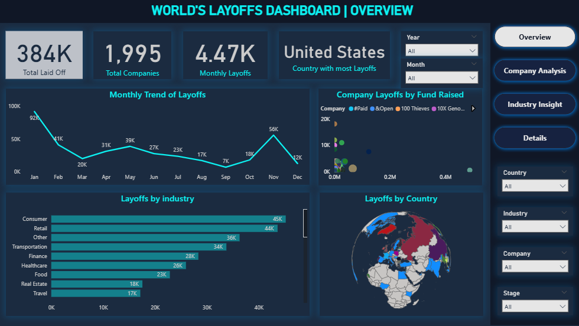
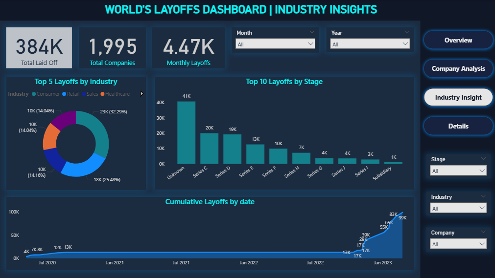
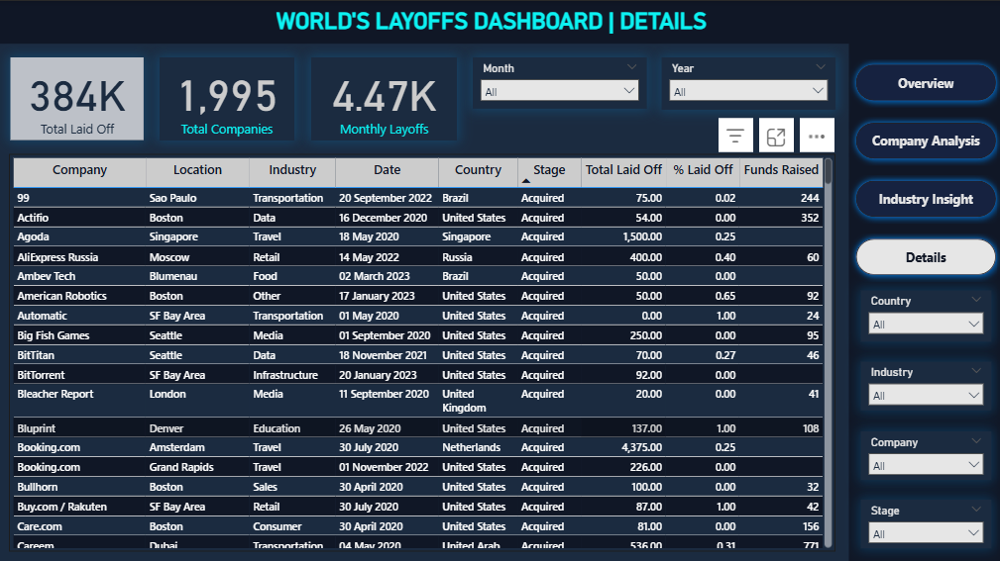

💻 
# World's Layoffs Data Analysis

## Table of Contents

- [Project Overview](#project-overview)
- [Problem Statement](#problem-statement)
- [Key Visuals in the Power BI Dashboard](#key-visuals-in-the-power-bi-dashboard)
- [Key Insights](#key-insights)
- [Tools and Technologies](#tools-and-technologies)
- [Database Structure](#database-structure)
- [Key Features](#key-features)
- [How to Run the Project](#how-to-run-the-project)
- [Access Full Documentation](#access-full-documentation)
- [License](#license)
- [Acknowledgments](#acknowledgments)

________________________________________
📚 
## Project Overview
This project is designed to analyze and visualize data on layoffs across various companies and industries. The primary goal is to provide insights into trends, patterns, and underlying factors influencing layoffs, allowing decision-makers to understand the broader impact on the workforce. It focuses on cleaning and analyzing the global layoffs dataset using SQL. The goal is to transform messy real-world data into a structured format and perform deep exploratory analysis to uncover valuable business insights.
________________________________________
❗
## Problem Statement
- What industries are most vulnerable to large-scale layoffs globally?
- How do layoffs trend over time, and what months experience the highest employee cuts?
- Which countries and companies are contributing most to global layoff figures?
- Are companies with lower funding more likely to lay off employees?
- Do some companies fully shut down during layoffs, and how frequent is this?
________________________________________
📊
## Key Visuals in the Power BI Dashboard:

🔎
### Overview
- Provides a high-level summary of layoffs over time.
- Key trends and patterns are visualized to highlight peak periods of layoffs and overall workforce reduction.
  

🏢
### Company Analysis
- Visualizes layoffs by individual company, allowing for comparison across different organizations.
- Helps identify which companies have experienced the most significant workforce reductions.

🏭
### Industry Insight
- Breaks down layoffs by industry to show which sectors are seeing the most significant impact.
- Aids in understanding broader market conditions and the impact on specific industries.

🧾
### Details
- Focuses on more granular data, such as layoffs by department, region, or specific time periods.
- Allows users to explore different aspects of the data, helping to uncover specific patterns and insights.

________________________________________
💡 
## Key Insights
- Total layoffs reached 384K, with the United States being the most affected country and over 1,294 companies involved.
- Consumer and Retail industries experienced the highest layoffs, followed by Transportation and Finance.
- January and November saw the biggest spikes in layoffs, while September and December recorded the lowest.
- Several companies laid off 100% of their workforce, indicating complete shutdowns, especially among early-stage or low-funded firms.
- A few large companies consistently contributed to the majority of layoffs year over year, highlighting repeated downsizing by major players.
________________________________________
🛠️ 
## Tools and Technologies
-	SQL Server / MySQL Workbench
-	SQL (CTEs, Window Functions, Aggregates, Data Cleaning)
-	Excel / Power BI / DAX
________________________________________
🗄️ 
## Database Structure
-	Database Name: **`world_layoffs`**
-	Table Used: **`layoffs_staging2`** (fully cleaned and standardized)
________________________________________
⚙️ 
## Key Features
-	Duplicate removal using CTEs and ROW_NUMBER()
-	Data standardization (company names, industries, countries)
-	NULL value handling and replacement
-	Text-to-date conversion and data type normalization
-	Monthly and cumulative layoffs analysis
-	Company ranking based on yearly layoffs
________________________________________
🚀 
## How to Run the Project
1.	Load the dataset into your SQL environment.
2.	Create tables (layoffs_staging, layoffs_staging2) as per the provided SQL scripts.
3.	Run Data Cleaning scripts first, then Exploratory Data Analysis (EDA) queries.
4.	(Optional) Visualize findings in a BI tool like Power BI or Tableau.
________________________________________
📄 
## Access Full Documentation
👉 Dataset [link](./Dataset/layoffs.csv)
________________________________________
📜 
## License
This project is licensed under the MIT License.
________________________________________
🙌 
## Acknowledgments
Inspired by real-world datasets and challenges in workforce dynamics and economic downturn studies.
